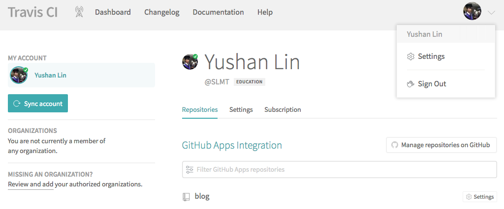

最近將我的部落格改成使用 [Travis CI][1] 來自動發布，幫我省去在自己電腦上編譯再上傳到 Github Pages 的麻煩。 因此我將我的作法寫下來，幫助其他用 Hexo 建立 Blog 的人來設定自動發布。

<!--more-->

## 本文適合族群

本文適合給跟我一樣使用 Hexo 來建立 blog，而且覺得要在本地端先用 `hexo generate` 再另外丟到其他 branch 或 repository 很麻煩的人。

## 概念

這邊使用的方式是讓 Travis CI 來幫我們自動產生網頁，並將產生後的網頁自動上傳到 Github Pages 的做法。

Travis CI 是一種 Continous Integration 的服務，他可以連結到 Github 的 repository 上面，並自動幫你執行預先寫在 repository 上面的 script。 Travis CI 通常用於測試 repository 上面的程式碼是否正常，能否正常編譯，是否能透過 test cases 等等。

Travis CI 會在 repository 上有新的 commit 上傳時被自動觸發，並且使用者可以提供自己的 script 供 Travis CI 執行各種工作，因此許多人會用 Travis CI 來自動發布程式碼。

## 步驟

以下說明如何用 Travis CI 自動發布。 假設你在 Github 上已經擁有一個 repository。


### 第一步：申請 Travis CI 帳號

請先到 [Travis CI][1] 網站申請一個帳號。

注意如果搜尋的話會發現 Travis CI 有兩個網站：一個是 travis-ci.com，另一個是 travis-ci.org。 .org 是比較早出來的服務，.com 則是後來為了商業目的而建立的網站。 [官方聲明][2] 建議所有的 project，包括 open source project 都使用 .com 的服務。


### 第二步：在 Travis CI 上連結 Github Project

接下來要讓 Travis CI 知道你的 repository 的存在。

首先先到 Travis CI 上的設定畫面



選擇 Manage Repositories on Github

選擇自己 blog 的 repository。

Approve


### 第三步：申請 Github Access Token

這步驟要到 Github 上申請一個 token，讓 Travis CI 取得上傳網頁到自己的 Github repository 上的權力。

到 Github 上的個人設定頁面。

選擇 Developer Settings 進入開發者設定頁面。

點選 Personal Access Token。

Generate new token

設定 token 名稱，並給予 repo -> public_repo 權限。

將 token 複製下來，注意不要讓其他人取得這個 token。

把 token 貼到 Travis CI 的設定頁面上。

### 第四步：在 Project 內加入 Travis CI 設定檔

以上這些設定都搞定後，再來就是要在 blog 的 project 內放入 Travis CI 的設定檔。 裡面會包含如何正確產生網頁，以及上傳資料到 Github 的指令。

這一步驟只需要在自己的 project 中，最上層資料夾內放入一個 `.travis.yml` 檔，並放入以下內容：

```yml
language: node_js

sudo: false

branches:
  only:
  - master

cache:
  - npm

node_js:
  - "10"

before_script:
  - npm install
  - hexo cl

script:
  - hexo generate

deploy:
  provider: pages
  skip-cleanup: true
  github-token: $GITHUB_TOKEN
  local-dir: public
  keep-history: false
  on:
    branch: master
```

這樣就完成了！ 之後每次 commit、push 資料到 Github 上之後，Travis CI 就會自動產生 blog 頁面，並上傳到 Github Page。

### 第五步：觀察有沒有問題

### 完成！

## 附錄：解說 `.travis.yml` 內容

這邊大致說明一下設定檔的內容，這樣如果想根據自己需求修改，也會比較方便一點。 詳細的說明可以參考 [官方文件][3]。

```yml
language: node_js

node_js:
  - "10"
```

這兩條設定分別指定這個 repository 要用 Node.js 的環境執行，並且要用第 10 版的 Node.js。

```yml
branches:
  only:
  - master
```

這條設定只有在 master branch 有發生變化時（新的 commit），Travis CI 才會執行。

```yml
cache:
  - npm
```

這條設定會讓 Travis CI 保存 NPM 下載的 library。 因為 Travis CI 每次執行時都會使用一個全新的環境，如果保存之前下載過的 library 的話，可以節省重新下載 library 的時間。

```yml
before_script:
  - npm install
  - hexo cl
```

這條設定定義了執行主要指令之前，應該先執行甚麼指令做準備。 第一條安裝 library，第二條則會清空之前曾經自動建立過的資料，以保持環境整潔。

```yml
script:
  - hexo generate
```

這條設定執行了產生 blog 網頁的指令。

```yml
deploy:
  provider: pages
  skip-cleanup: true
  github-token: $GITHUB_TOKEN
  local-dir: public
  keep-history: false
  on:
    branch: master
```

這條設定是由 Travis CI 特別提供用來發布程式用的，其中 `provider: pages` 設定要發布到 Github Pages，這邊會由 Travis CI 自己想辦法把指定內容上傳上去。 `github-token: $GITHUB_TOKEN` 這邊會引入稍早設定的 token，用來取得上傳的權限。 `local-dir: public` 指定上傳 `public` 資料夾內的內容。 `on: branch: master` 這條有點特別，我原先以為是上傳的目的地 branch，但其實指的是 source branch。

[1]: https://travis-ci.com/
[2]: https://blog.travis-ci.com/2018-05-02-open-source-projects-on-travis-ci-com-with-github-apps
[3]: https://docs.travis-ci.com/